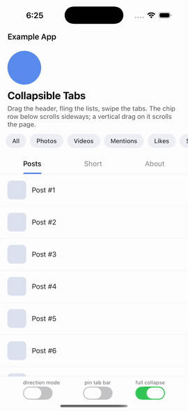
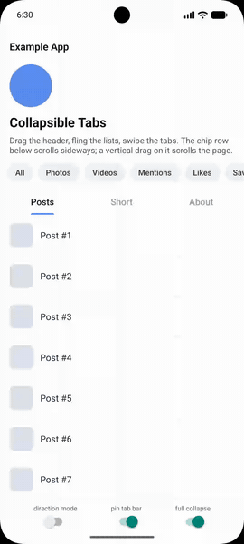

# react-native-collapsible-tabs-native

Native **collapsible tabs** for React Native: a collapsing header with a
pinned tab bar over a swipeable tab pager — the Instagram / Twitter profile
layout — where the collapse is driven by **native code** (UIKit on iOS,
`ViewPager2` on Android), not by a JS or Reanimated worklet.

Because the header is translated inside the same native scroll callback that
moves the list, the header, tab bar and list content always move **in the
same frame**. There is no per-frame JS work in the scroll path, so heavy JS
load cannot desynchronise them.

Your header, tab bar and tab pages are ordinary React components. The native
side only owns geometry and gestures.

<p>
  <a href="https://www.npmjs.com/package/react-native-collapsible-tabs-native"></a>
  <a href="https://github.com/ramssutharr/react-native-collapsible-tabs-native/blob/main/LICENSE"></a>
</p>

<p align="center">
  
  &nbsp;&nbsp;
  
</p>
<p align="center"><sub>The <a href="example">example app</a> on iOS and Android.</sub></p>

## Why not a JS implementation?

JS collapsible-tab libraries (including ones built on Reanimated) move the
list content from the native scroll view but move the header from an
animation callback fed by that scroll's *event*. Two update paths mean the
header runs at least one frame behind the list — visible as a gap opening
between the tab bar and the content on a fast fling, worst on Android and on
iOS whenever the JS thread is busy. This library removes the second update
path instead of trying to keep up with it.

## What it does

- Collapsing header + pinned tab bar over a native horizontal pager, in
  frame-perfect sync with the active list (native
  `UIScrollViewDelegate` / `View.OnScrollChangeListener`). The tab bar can
  also collapse away with the header (`pinTabBar={false}`).
- Any vertical list that renders a React Native `ScrollView` works as a tab
  page: `ScrollView`, `FlatList`, `SectionList`,
  [FlashList](https://github.com/Shopify/flash-list),
  [LegendList](https://github.com/LegendApp/legend-list) — wrapped with
  `createTabList` so its content is padded under the header.
- Vertical drags on the header (or tab bar) scroll the active page, with a
  display-link-driven fling on iOS and native event forwarding on Android.
  Horizontal lists inside the bands — a chip row in the header, the tab strip
  itself — keep their own sideways gestures, while their vertical drags still
  scroll the page.
- Swipe between tabs; a tab page mounts the moment it peeks into view (not
  when the swipe settles), and a freshly-mounted or neighbouring page is
  aligned to the current header offset before it becomes visible.
- Optional per-frame swipe position (`onPageScroll`) so a custom tab bar can
  interpolate its indicator with the finger — on the UI thread via a
  Reanimated worklet, so the JS thread still does nothing per frame.
- Tabs with little or no content (an empty state, one row) still scroll the
  header away, because native gives those pages exactly the scroll range they
  lack (`allowFullCollapse`, on by default).
- Container-level pull-to-refresh (`refreshing` / `onRefresh`): the scroll
  view bounce on iOS, `SwipeRefreshLayout` on Android.
- `onCollapsedChange` fires once per threshold crossing (not per frame) — use
  it to swap fixed chrome, e.g. reveal a title in your own top bar.
- Presses under a finger that scrolled are cancelled correctly: a swipe that
  ends on a `Pressable` does not trigger it; a deliberate tap does.
- A minimal default `TabBar` (equal-width labels + underline, colours via
  props), or bring your own with `renderTabBar`.
- TypeScript types throughout.

## What it does **not** do

Read this before choosing the library — these are real constraints, not
roadmap fine print:

- **New Architecture (Fabric) only.** No Paper support. React Native ≥ 0.76
  (developed and tested on RN 0.83).
- The **list** scroll position is not exposed to JS at all. You get
  `onPageSelected`, `onPageRevealed` and the `onCollapsedChange` crossing —
  nothing per-frame from the scroll path (that's the point). The pager's swipe
  position IS available via `onPageScroll`, but only when you ask for it, and
  it is meant for a Reanimated worklet — see below.
- `onPageScroll` with RN `Animated.event` + `useNativeDriver: true` does
  **not** work, and cannot: on Fabric, native-driven animated events only
  reach the animated module through a deprecated back-channel React Native
  special-cases for its own ScrollView and has marked for removal. Use a
  Reanimated `useEvent` worklet (UI thread, no per-frame JS) or accept a plain
  JS callback.
- No min-header / sticky-segment support: the header collapses fully as one
  band (choose `collapseMode` for when it comes back).
- Horizontal swipes that start **on the header** are deliberately inert (they
  neither page nor scroll). Swipe on the content or use the tab strip. The
  tab-bar band scrolls its own content horizontally if you render one that
  does.
- A tab whose content is too short is given the scroll range it lacks, so it
  collapses like any other (`allowFullCollapse`, on by default). Set it to
  `false` for the Twitter-style alternative, where the header instead eases
  back to whatever offset that tab can hold — but note that a page with no
  scroll range at all cannot be scrolled or collapsed, and drags in the blank
  area below its content do nothing.
- Pull-to-refresh thresholds are fixed (≈70 pt pull, 60 pt spinner band on
  iOS; platform defaults on Android) and the spinner is not customisable yet.
- Pages stay mounted once visited (`lazy` only defers the first mount). A
  page mounts as soon as any sliver of it peeks in during a swipe, not when
  the swipe settles — so its data fetch starts if you drag toward it and
  change your mind.
- No web / Expo Go support (native code; works in Expo dev clients / prebuild).

## Example

`example/` is a bare RN app wired straight to the repo's `src/` and native
code (no copying) — `cd example && yarn install`, then the usual `yarn ios` /
`yarn android`. See [example/README.md](example/README.md).

## Install

```sh
yarn add react-native-collapsible-tabs-native
cd ios && pod install
```

Autolinked on both platforms. New Architecture must be enabled (default since
RN 0.76).

The package ships untranspiled TypeScript (Metro handles it natively). **Jest
does not** — if your tests import a screen that uses this package, allow it
through `transformIgnorePatterns` in your Jest config:

```js
transformIgnorePatterns: [
  'node_modules/(?!(react-native|@react-native|react-native-collapsible-tabs-native)/)',
],
```

`react-native-reanimated` is an **optional** peer: it is only required (or
even imported) if you pass a Reanimated `useEvent` worklet to `onPageScroll`.

## Usage

```tsx
import { useState } from 'react';
import { FlashList } from '@shopify/flash-list';
import {
  CollapsibleTabView,
  createTabList,
  TabScrollView,
} from 'react-native-collapsible-tabs-native';

const TabFlashList = createTabList(FlashList);

const routes = [
  { key: 'posts', title: 'Posts' },
  { key: 'about', title: 'About' },
];

function Profile() {
  const [index, setIndex] = useState(0);
  const [refreshing, setRefreshing] = useState(false);
  const [collapsed, setCollapsed] = useState(false);

  return (
    <>
      <TopBar title={collapsed ? user.name : undefined} />
      <CollapsibleTabView
        navigationState={{ index, routes }}
        onIndexChange={setIndex}
        renderHeader={() => <ProfileHeader user={user} />}
        renderScene={({ route }) =>
          route.key === 'posts' ? (
            <TabFlashList data={posts} renderItem={renderPost} numColumns={3} />
          ) : (
            <TabScrollView>
              <About user={user} />
            </TabScrollView>
          )
        }
        refreshing={refreshing}
        onRefresh={async () => {
          setRefreshing(true);
          await reload();
          setRefreshing(false);
        }}
        collapseThreshold={120}
        onCollapsedChange={setCollapsed}
        tabBarProps={{ activeColor: '#fff', inactiveColor: '#888', indicatorColor: '#BAFF11' }}
      />
    </>
  );
}
```

### The one rule

Tab bodies **must** pad their content by the header + tab-bar height — the
bands are overlaid on the pager, not stacked above it. `createTabList` (and
the bundled `TabScrollView` / `TabFlatList`) do this for you; or read
`useCollapsibleTabs().contentPaddingTop` and apply it yourself.

## API

### `<CollapsibleTabView>`

| prop | type | notes |
| --- | --- | --- |
| `navigationState` | `{ index, routes }` | routes are `{ key, title }` (`react-native-tab-view` shape) |
| `renderScene` | `({ route }) => ReactNode` | one page per route |
| `onIndexChange` | `(index) => void` | tab press or swipe settled |
| `renderHeader` | `() => ReactNode` | the collapsing header |
| `renderTabBar` | `({ routes, index, onIndexChange }) => ReactNode` | defaults to `TabBar`. Want the tabs to scroll away with the header? Keep them here and pass `pinTabBar={false}` — don't move them into `renderHeader` (pages clear the tab-bar band's height either way, and an empty band gives the shell nowhere to put the tabs back without landing on content) |
| `tabBarProps` | `TabBarProps` | colours/`onTabPress` for the default `TabBar`; ignored with `renderTabBar` |
| `refreshing` / `onRefresh` | `boolean` / `() => void` | container-level pull-to-refresh; keep `refreshing` true until done |
| `collapseThreshold` | `number` (dp) | crossing point for `onCollapsedChange` |
| `collapseMode` | `'classic' \| 'direction'` | `'classic'` (default): header returns as content nears the top. `'direction'`: any up-scroll reveals it, any down-scroll hides it |
| `pinTabBar` | `boolean` | default **`true`**: the tab bar stays pinned at the top once the header is gone. `false`: the whole band, tabs included, collapses as part of the header |
| `allowFullCollapse` | `boolean` | default **`true`**. Tabs too short to scroll collapse the header anyway — native gives such a page exactly the scroll range it lacks; tabs with enough content are untouched. `false` restores the old behaviour |
| `onCollapsedChange` | `(collapsed) => void` | fires on crossings only |
| `onPageScroll` | Reanimated `useEvent` handler, or `(e) => void` | the pager's live swipe position, for a tab indicator that tracks the finger. Emitted only while a handler is set. A worklet reads it on the UI thread; a plain function costs a JS call per frame |
| `swipeEnabled` | `boolean` | default `true` |
| `lazy` | `boolean` | default `true`; mount a page on first visit |
| `style` | `ViewStyle` | shell container style |

### Tracking the swipe (interpolating a tab indicator)

`onPageScroll` reports the pager's position (`position` + `offset`, i.e. page
index plus 0..1 towards the next) every frame while a handler is attached.
Read it in a Reanimated worklet and the JS thread stays idle:

```tsx
import { useEvent, useSharedValue } from 'react-native-reanimated';

const progress = useSharedValue(-1); // -1 = the pager hasn't moved yet
const onPageScroll = useEvent<{ position: number; offset: number }>(
  event => {
    'worklet';
    progress.value = event.position + event.offset;
  },
  ['topPageScroll', 'onPageScroll'],
);

<CollapsibleTabView … onPageScroll={onPageScroll} renderTabBar={…} />
```

Your tab bar then interpolates a single indicator between measured tab
positions from `progress`. Reanimated is an optional peer dependency: it is
only required (and only imported) if you pass a worklet handler.

### `createTabList(List)`

Wraps any list component that renders an RN `ScrollView` and forwards
`contentContainerStyle`, adding the shell's top padding. `TabScrollView` and
`TabFlatList` ship prebuilt:

```ts
const TabFlashList = createTabList(FlashList);
const TabLegendList = createTabList(LegendList);
```

### `<TabBar>`

The default strip: equal-width labels with an underline.
Props: `routes`, `index`, `onIndexChange`, `onTabPress?`, `activeColor?`,
`inactiveColor?`, `indicatorColor?`, `backgroundColor?`, `style?`.

### `<CollapsibleTabsShell>`

The lower-level primitive if you don't want the tab-view-shaped API:
`header` / `tabBar` / `pages[]` / `index` / `onIndexChange` plus the same
collapse/refresh props.

### `useCollapsibleTabs()`

`{ isNativeShell, contentPaddingTop, activeIndex }` — for custom tab bodies.

## How it works

Fabric mounts your header, tab bar and pages as children of the native view;
the native side re-parents them by `nativeID` into slots: a header band and a
tab-bar band drawn above a horizontal pager (paging `UIScrollView` on iOS,
`ViewPager2` on Android). The active page's vertical scroll view is located
and observed natively; its offset, clamped to the header height, becomes the
bands' translation — applied in the same callback that moved the content.
Neighbouring pages are pre-aligned during a swipe, and pages that mount late
are aligned as their content grows. When the shell takes over a gesture it
cancels React's in-flight touch, so buttons under the finger don't fire.

The native code is small and commented —
[`ios/NativeCollapsibleTabsContent.swift`](ios/NativeCollapsibleTabsContent.swift)
and
[`android/src/main/java/com/collapsibletabs/ui/CollapsibleTabsHostView.kt`](android/src/main/java/com/collapsibletabs/ui/CollapsibleTabsHostView.kt)
are the two files that matter.

## FAQ

**Is this a drop-in replacement for react-native-collapsible-tab-view or
react-native-tab-view?**
No. The `navigationState` / `renderScene` shape is intentionally similar so
migration is mechanical, but the props are not identical and list scroll
positions are not exposed to JS.

**Does it work with react-native-screens / React Navigation?**
Yes — it's a regular view; render it inside any screen.

**Sticky items inside the header?**
Not supported. The header collapses as one band; the tab bar is the only
pinned element (and you can move your tabs *into* the header and pin
nothing).

## Keywords

react-native collapsible tabs · collapsing header · sticky tab bar · profile
header tabs · tab view · FlashList · Fabric · new architecture · UIScrollView
· ViewPager2

## License

MIT © Ram Suthar
